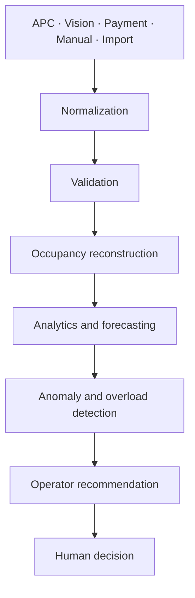

# TrackBus architecture

## Product boundary

TrackBus is vendor-neutral and APC-first. Vision is an optional edge source, not
a mandatory dependency and not a facial-recognition system. Every approved
source is adapted into the same canonical passenger-count event.



## Service boundaries

- **Source adapters:** translate vendor payloads without leaking vendor fields
  into domain logic.
- **Vision edge runtime:** detects people, assigns temporary track IDs, confirms
  doorway paths, and emits counts. Raw frames stay local by default.
- **Analytics API:** validates normalized events, rejects impossible values, and
  provides an idempotent persistence boundary.
- **Pilot event store:** supplies durable SQLite storage and operational read
  models; PostgreSQL/Timescale remains a later adapter decision.
- **Forecast service:** starts with a transparent baseline and promotes trained
  models only after representative evaluation.
- **Applications:** expose occupancy bands, source health, reconciliation, and
  operator-approved recommendations—never raw passenger video.

## Vision processing

The proven v0.2.1 pipeline separates detection from tracking. Enabled inference
views contribute source-coordinate YOLO detections, exclusions remove known
door structure, NMS fuses duplicates, and exactly one ByteTrack instance
advances once per decoded frame. The showcase adds a conservative three-zone
event layer:

```text
OUTSIDE -> DOOR -> INSIDE = BOARDING / +1 occupancy
INSIDE  -> DOOR -> OUTSIDE = ALIGHTING / -1 occupancy
```

Incomplete, reversed, expired, and noisy paths do not count. The detector and
tracker remain independent from the canonical event and API clients, so the
same domain logic can accept a future vendor APC adapter.

## Canonical event flow

Vision and other adapters produce `eventId`, `source`, bus/route/stop/door IDs,
an observed timestamp, boarding/alighting deltas, reconstructed occupancy,
confidence, and quality flags. The API stores the same contract, applies
idempotency by `eventId`, and returns quality issues. The dashboard reads
operational summaries instead of fabricated acknowledgements from the web
gateway.

## Deployment decisions

1. Store timestamps with timezone information and normalize comparisons to UTC.
2. Use stable operator-issued identifiers for buses, routes, stops, and doors.
3. Require human approval for operational recommendations.
4. Isolate demonstration, calibration, pilot, and production data.
5. Keep raw video local unless an approved, documented evidence workflow needs it.
6. Do not connect TrackBus recommendations to safety-critical vehicle control.

Detailed Vision internals remain documented in
[`docs/v0.2.1-event-stability.md`](v0.2.1-event-stability.md).
