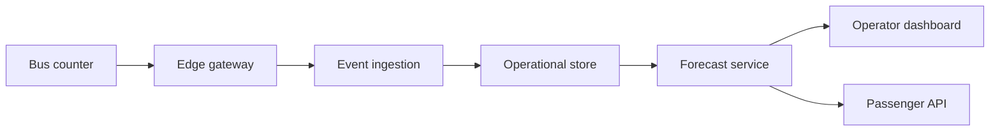

# TrackBus architecture

## Goal

Turn anonymous passenger counts and vehicle locations into reliable occupancy
information, demand forecasts, and auditable dispatch recommendations.

## Service boundaries

- **Bus counter:** detects boarding and alighting. It may be the existing APC
  sensor or a future TrackBus camera model.
- **Edge gateway:** attaches bus, route, stop, time and sensor-health metadata.
- **Analytics API:** validates the versioned event contract and isolates vendor
  protocols from TrackBus storage and models.
- **Pilot event store:** provides idempotent durable SQLite storage. The adapter
  boundary permits a later PostgreSQL/Timescale replacement.
- **Forecast service:** begins with a transparent baseline. Trained models are
  promoted only through measured evaluation and monitoring.
- **Applications:** operator and passenger views receive occupancy bands and
  forecasts, not raw passenger video.

## First deployment decisions

1. Store timestamps in UTC and retain the source timezone in metadata.
2. Use stable government-issued IDs for buses, routes and stops.
3. Make every dispatch recommendation explainable and require operator approval.
4. Keep demonstration, staging and production data isolated.
